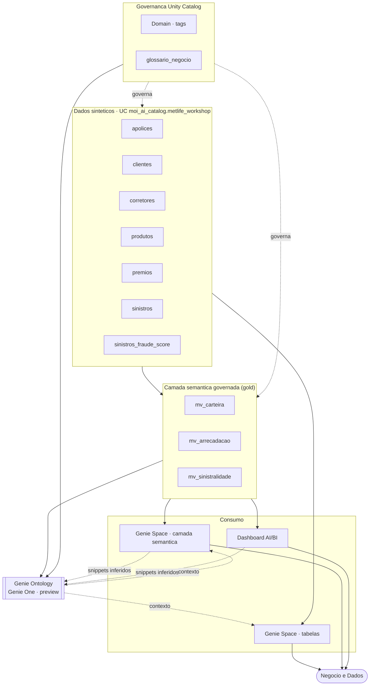
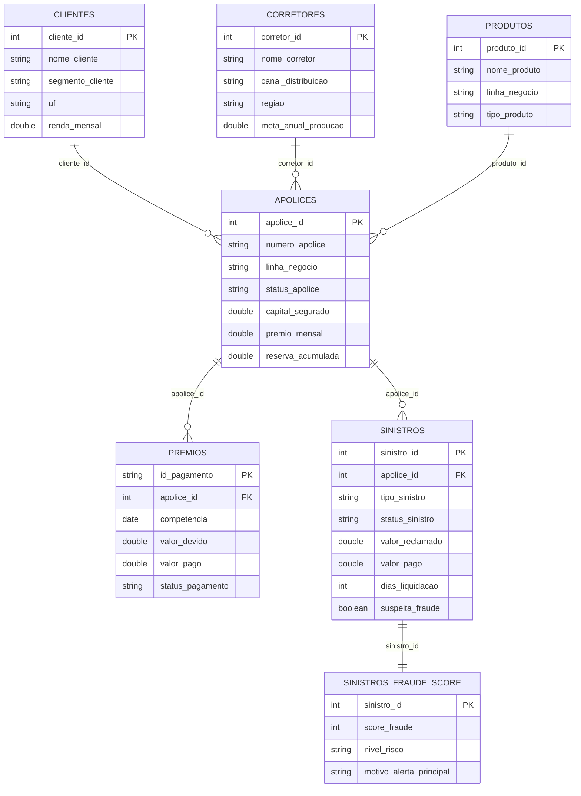

# Arquitetura do Workshop

Dois diagramas: (1) o **fluxo de arquitetura** — das tabelas à camada semântica, ao consumo (Genie/Dashboard) e ao Genie Ontology; (2) o **modelo de dados** (relacionamentos entre as 7 tabelas).

## 1. Fluxo de arquitetura

**Leitura.** As 7 tabelas alimentam tanto a exploração direta (Genie sobre tabelas) quanto a **camada semântica** (Metric Views), que por sua vez serve o Genie de métricas governadas e o dashboard. A **governança do Unity Catalog** (Domain via tags + glossário) e os Metric Views são a *fonte da verdade* do **Genie Ontology**; dashboards e queries geram *snippets inferidos* de alta autoridade; e o Ontology devolve contexto de negócio para os Genie Spaces.

## 2. Modelo de dados

**Metric Views** (camada gold, uma por fato): `mv_carteira` (apólices), `mv_arrecadacao` (prêmios), `mv_sinistralidade` (sinistros + score de fraude).
